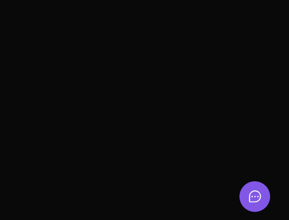
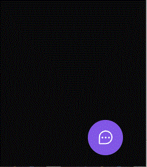
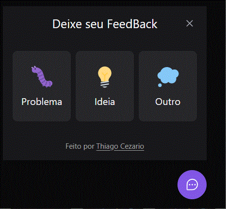
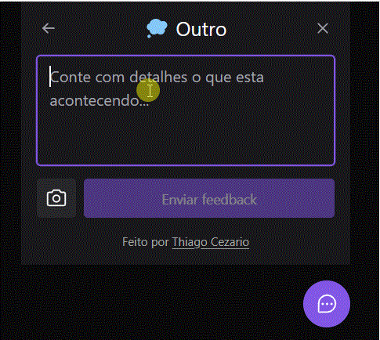
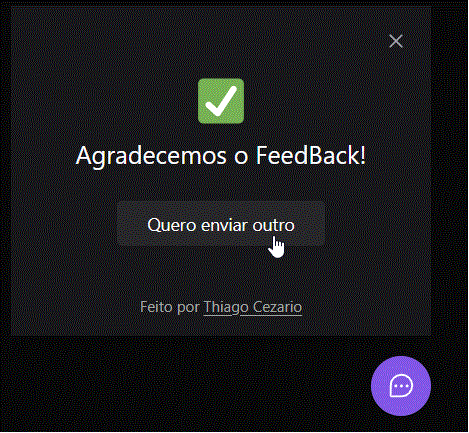

<div align="center"> 
    <h1>Feedget </h1>
</div>


<p align="center">Desenvolvido um widget completo e acessível, que pode ser utilizado em vários projetos para, coletar feedbacks e relatórios dos usuários, todo o backend e frontend da aplicação foi feito em ReactJS/ Vite/ TypeScript. e o aplicativo em sua versão mobile Desenvolvido com React Native</p>

<p align="center">
   <a href="#features">features</a> •
   <a href="#Pré-requisitos">Pré-requisitos</a> • 
   <a href="#Demonstração do Projeto">Demonstração do Projeto</a> •
   <a href="#Rodando-a-Aplicação">Rodando a Aplicação</a> •
   <a href="#Tecnologias">Tecnologias</a> •
   <a href="#Autor">Autor</a>
</p>

---
<br>

# Demonstração do Projeto
<P>Teste o Projeto Clicando a seguir: &nbsp;&nbsp;<a href="https://nlw-return-sage-eight.vercel.app/"></p>
<br>

# Gifs 🎥

<h1>
    
    
    
    
    
</h1>

# Features 
- [x] Receber FeedBacks
- [x] Receber e esclarecer Duvidas
- [x] Reportar Problemas na Aplicação

<br>
    
# Pré-requisitos
Você vai precisar ter instalado na sua maquina as seguintes ferramentas:
   
  
  <a href="https://git-scm.com/">
    
  </a>&nbsp;&nbsp;
  <a href="https://nodejs.org/en/">
            
  </a>&nbsp;&nbsp;
   

---
  <br>
    
# Rodando-a-Aplicação    
    
```bash
    # Clone o repositório

$ git clone https://github.com/Thiago-cez/NLW-return

# Entre no repositório

$ cd NLW-return

# Selecione um dos diretórios

$ cd web

$ cd mobile

$ cd server

# Variáveis .ENV (Configuração Inicial)

$ DATABASE_URL="file:./dev.db"

# Instale as dependências

$ npm install

# Execute a aplicação

$ npm run dev
    
    # o servidor iniciará na porta: 3000 - acesse <http://localhost:3000>
```
---
     
# Tecnologias
    
   <a href="#">
    
  </a>&nbsp;&nbsp;
  <a href="#">
            
  </a>&nbsp;&nbsp;
  <a href="#">
            
  </a>&nbsp;&nbsp;
  <a href="#">
            
  </a>&nbsp;&nbsp; 
    <a href="#">
            
  </a>&nbsp;&nbsp; 
  <a href="#">
            
  </a>&nbsp;&nbsp;
     <a href="#">
            
  </a>&nbsp;&nbsp;
    <a href="#">
            
  </a>&nbsp;&nbsp;
<br>

